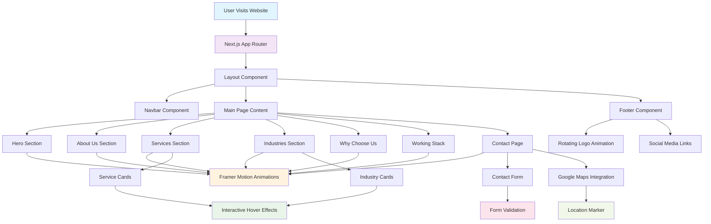

# AURAMATICS - Data & AI Solutions

<div align="center">


**Transforming businesses with intelligent technology**

[](https://nextjs.org/)
[](https://reactjs.org/)
[](https://www.typescriptlang.org/)
[](https://tailwindcss.com/)
[](https://www.framer.com/motion/)

</div>

A modern, responsive website for AURAMATICS, a technology solutions company specializing in data engineering, AI, and custom software development. Built with Next.js 15, TypeScript, and enhanced with Framer Motion animations.

## 🚀 Live Demo

[View Live Site](https://your-domain.com) <!-- Replace with actual domain -->

## 📋 Table of Contents

- [About](#about)
- [Features](#features)
- [Architecture Flow](#architecture-flow)
- [Technologies Used](#technologies-used)
- [Project Structure](#project-structure)
- [Getting Started](#getting-started)
- [Available Scripts](#available-scripts)
- [Services](#services)
- [Industries Served](#industries-served)
- [Contributing](#contributing)
- [License](#license)

## 🏢 About

AURAMATICS is a technology solutions company that creates intelligent ecosystems to drive growth. We specialize in:

- **Data Engineering**: Building reliable data foundations with pipelines, ETL, and cloud integration
- **Data Analysis & Visualization**: Turning complex data into actionable insights
- **Data Science & AI**: Harnessing the power of AI with intelligent workflows
- **Agentic AI & Automation**: Automating and optimizing business processes
- **Web Development**: Modern websites, web apps, and SaaS platforms
- **Mobile App Development**: Cross-platform applications for iOS and Android

## ✨ Features

- **Responsive Design**: Fully responsive layout that works on all devices
- **Modern UI/UX**: Clean, professional design with smooth animations
- **Smooth Navigation**: Single-page application with smooth scrolling between sections
- **Interactive Components**: Engaging user interface with hover effects and transitions
- **Technology Showcase**: Comprehensive display of our technology stack
- **Industry Focus**: Dedicated sections for different industries we serve
- **Contact Integration**: Easy-to-use contact forms and call-to-action buttons
- **Interactive Animations**: Smooth Framer Motion animations throughout the site
- **Responsive Map Integration**: Google Maps integration with location markers

## 🏗️ Architecture Flow



## 🛠 Technologies Used

### Core Framework & Language

- **Next.js 15.5.2** - React framework for production with App Router
- **React 19.1.0** - JavaScript library for building user interfaces
- **TypeScript 5** - Typed superset of JavaScript for better development experience
- **Node.js** - JavaScript runtime environment

### Styling & UI

- **Tailwind CSS 4** - Utility-first CSS framework for rapid UI development
- **PostCSS** - CSS processing tool for Tailwind CSS
- **React Icons 5.5.0** - Popular icon library with 10,000+ icons
- **Framer Motion 12.23.12** - Production-ready motion library for React
- **Custom CSS** - Additional styling for specific components

### Development Tools

- **ESLint 9** - Code linting and formatting
- **ESLint Config Next** - Next.js specific ESLint configuration
- **@eslint/eslintrc** - ESLint configuration utilities
- **Git** - Version control system

### Type Definitions

- **@types/node 20** - TypeScript definitions for Node.js
- **@types/react 19** - TypeScript definitions for React
- **@types/react-dom 19** - TypeScript definitions for React DOM

### Build & Deployment

- **Next.js Build System** - Optimized production builds
- **Static Site Generation** - Pre-rendered pages for better performance
- **Image Optimization** - Next.js Image component for optimized images

## 📦 Dependencies

### Production Dependencies

```json
{
  "next": "15.5.2",
  "react": "19.1.0",
  "react-dom": "19.1.0",
  "react-icons": "^5.5.0",
  "framer-motion": "^12.23.12"
}
```

### Development Dependencies

```json
{
  "@eslint/eslintrc": "^3",
  "@tailwindcss/postcss": "^4",
  "@types/node": "^20",
  "@types/react": "^19",
  "@types/react-dom": "^19",
  "eslint": "^9",
  "eslint-config-next": "15.5.2",
  "tailwindcss": "^4",
  "typescript": "^5"
}
```

## 🏗️ Architecture & Features

### Next.js App Router

- **App Directory Structure** - Modern Next.js 13+ routing system
- **Server Components** - Optimized rendering on the server
- **Client Components** - Interactive components with "use client" directive
- **Layout System** - Nested layouts for consistent UI structure

### Component Architecture

- **Modular Components** - Reusable, well-structured React components
- **TypeScript Interfaces** - Strong typing for props and data structures
- **Forward Refs** - Proper ref handling for DOM manipulation
- **Responsive Design** - Mobile-first approach with Tailwind CSS

### Performance Optimizations

- **Image Optimization** - Next.js Image component with lazy loading
- **Code Splitting** - Automatic code splitting by Next.js
- **Static Generation** - Pre-rendered pages for faster loading
- **CSS Optimization** - Tailwind CSS purging for smaller bundle sizes

## 🌐 Our Technology Stack (Services We Offer)

### Frontend Technologies

- **React** - Component-based UI library
- **Next.js** - Full-stack React framework
- **TypeScript** - Type-safe JavaScript
- **Tailwind CSS** - Utility-first CSS framework
- **HTML5 & CSS3** - Modern web standards

### Backend Technologies

- **Node.js** - JavaScript runtime for server-side development
- **Express.js** - Web application framework
- **Python** - Data science and AI development
- **GraphQL** - Query language for APIs

### Database Technologies

- **MongoDB** - NoSQL document database
- **PostgreSQL** - Relational database system
- **Redis** - In-memory data structure store

### Cloud & DevOps

- **AWS** - Amazon Web Services cloud platform
- **Google Cloud** - Google Cloud Platform
- **Microsoft Azure** - Microsoft's cloud platform
- **Docker** - Containerization platform
- **Kubernetes** - Container orchestration
- **Terraform** - Infrastructure as Code
- **Jenkins** - Continuous integration/continuous deployment
- **Nginx** - Web server and reverse proxy

### Development Tools

- **Git & GitHub** - Version control and collaboration
- **Linux/Ubuntu** - Operating system for development
- **Bootstrap** - CSS framework for responsive design

## 📁 Project Structure

```
auramatics_nofil/
├── public/
│   ├── favicon.ico
│   ├── favicon-16x16.png
│   ├── favicon-32x32.png
│   ├── favicon-64x64.png
│   ├── favicon.png
│   ├── 404.html
│   └── index.html
├── src/
│   ├── app/
│   │   ├── components/
│   │   │   ├── baselayout/
│   │   │   │   ├── footer.tsx
│   │   │   │   └── navbar.tsx
│   │   │   ├── heroSection/
│   │   │   │   ├── AboutUs.tsx
│   │   │   │   ├── Hero_new.tsx
│   │   │   │   ├── ServedIndustries.tsx
│   │   │   │   ├── Services.tsx
│   │   │   │   ├── WhyChoseUs.tsx
│   │   │   │   └── WorkingStack.tsx
│   │   │   └── subComponents/
│   │   │       ├── Floating3DObject.tsx
│   │   │       └── serviceFeatureCard.tsx
│   │   ├── aboutus/
│   │   │   └── page.tsx
│   │   ├── contact/
│   │   │   └── page.tsx
│   │   ├── globals.css
│   │   ├── imageLoader.ts
│   │   ├── layout.tsx
│   │   └── page.tsx
│   └── assets/
│       ├── aboutus/
│       │   ├── account-group-outline.svg
│       │   ├── face-agent.svg
│       │   └── lightbulb-outline.svg
│       └── Homepage/
│           ├── background.png
│           └── logo_new.png
├── package.json
├── next.config.ts
├── postcss.config.mjs
├── tsconfig.json
└── README.md
```

## 🚀 Getting Started

### Prerequisites

- Node.js 18.0 or later
- npm or yarn package manager

### Installation

1. **Clone the repository**

   ```bash
   git clone https://github.com/your-username/AURAMATICS_Nofil.git
   cd AURAMATICS_Nofil
   ```

2. **Install dependencies**

   ```bash
   npm install
   # or
   yarn install
   ```

3. **Run the development server**

   ```bash
   npm run dev
   # or
   yarn dev
   ```

4. **Open your browser**
   Navigate to [http://localhost:3000](http://localhost:3000) to see the application.

## 📜 Available Scripts

- `npm run dev` - Start the development server
- `npm run build` - Build the application for production
- `npm run start` - Start the production server
- `npm run lint` - Run ESLint to check for code issues

## 🎯 Services

### Core Services

1. **Data Engineering**

   - Data Pipelines
   - ETL Processes
   - Data Warehousing
   - Cloud Integration

2. **Data Analysis & Visualization**

   - BI Dashboards
   - Custom Reporting
   - Data Storytelling

3. **Data Science & AI**

   - AI Agents
   - Process Automation
   - Intelligent Workflows

4. **Agentic AI & Automation**

   - Business Process Automation
   - Workflow Optimization
   - Scalable Solutions

5. **Web Development**

   - Modern Websites
   - Web Applications
   - SaaS Platforms

6. **Mobile App Development**
   - Cross-platform Apps
   - iOS & Android Development
   - Scalable Backend Solutions

## 🏭 Industries Served

- **Finance & Banking** - Financial technology solutions
- **Healthcare & Pharma** - Healthcare data and automation
- **Retail & eCommerce** - E-commerce platforms and analytics
- **Power and Telecom** - Infrastructure and communication solutions
- **Aviation** - Aviation industry software solutions
- **Manufacturing & Logistics** - Supply chain and manufacturing automation

## 🎨 Design System

### Color Palette

- **Primary Blue**: `#2596be` - Main brand color
- **Dark Blue**: `#011632` - Headers and important text
- **Gray**: `#3C4959` - Secondary text
- **White**: `#FFFFFF` - Background and contrast
- **Purple**: `#8B5CF6` - Accent color
- **Orange**: `#F97316` - Call-to-action color

### Typography

- **Primary Font**: Geist Sans
- **Monospace Font**: Geist Mono

### Animation Features

- **Framer Motion Integration**: Smooth page transitions and component animations
- **Rotating Logo**: Continuous step rotation animation in footer
- **Floating 3D Objects**: Interactive 3D elements with orbital animations
- **Hover Effects**: Interactive card hover animations
- **Scroll Animations**: Elements animate into view on scroll
- **Form Interactions**: Smooth form validation and submission animations

## 🗺️ Map Integration

- **Google Maps Embed**: Interactive map with location markers
- **Responsive Design**: Map adapts to different screen sizes
- **Location Services**: Easy integration with business location data

## 🚀 Deployment

### Build for Production

```bash
npm run build
npm run start
```

### Deploy to Vercel (Recommended)

1. Push your code to GitHub
2. Connect your repository to [Vercel](https://vercel.com)
3. Deploy automatically with zero configuration

### Deploy to Netlify

1. Build the project: `npm run build`
2. Deploy the `out` folder to Netlify
3. Configure redirects for SPA routing

### Environment Variables

Create a `.env.local` file for local development:

```env
NEXT_PUBLIC_GOOGLE_MAPS_API_KEY=your_google_maps_api_key
NEXT_PUBLIC_SITE_URL=http://localhost:3000
```

## 🤝 Contributing

We welcome contributions! Please follow these steps:

1. Fork the repository
2. Create a feature branch (`git checkout -b feature/AmazingFeature`)
3. Commit your changes (`git commit -m 'Add some AmazingFeature'`)
4. Push to the branch (`git push origin feature/AmazingFeature`)
5. Open a Pull Request

### Development Guidelines

- Follow TypeScript best practices
- Use Framer Motion for animations
- Maintain responsive design principles
- Test on multiple devices and browsers
- Follow the existing code style and structure

## 📄 License

This project is licensed under the MIT License - see the [LICENSE](LICENSE) file for details.

## 📞 Contact

- **Email**: info@auramtics.tech
- **Website**: [AURAMATICS](https://auramatics.com)
- **LinkedIn**: [AURAMATICS](https://linkedin.com/company/auramatics)

---

<div align="center">

**Built with ❤️ by the AURAMATICS team**

_Transforming businesses with intelligent technology_

</div>
